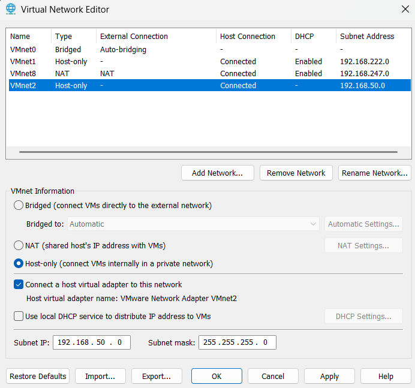
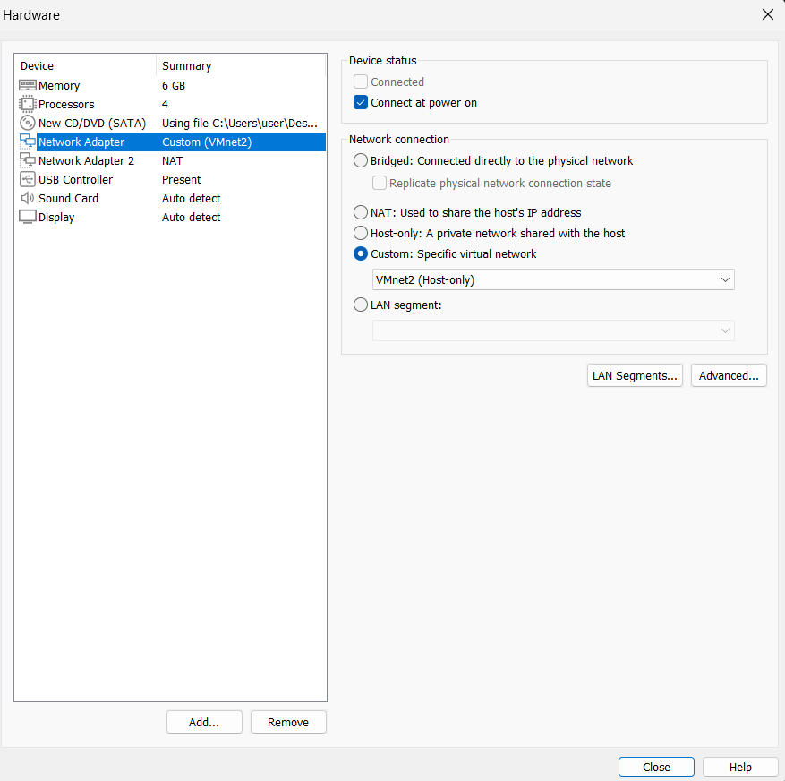
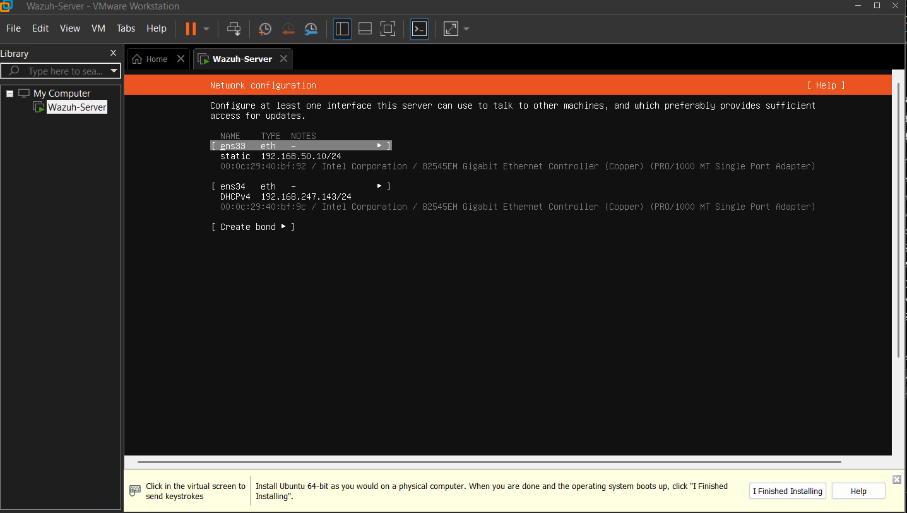
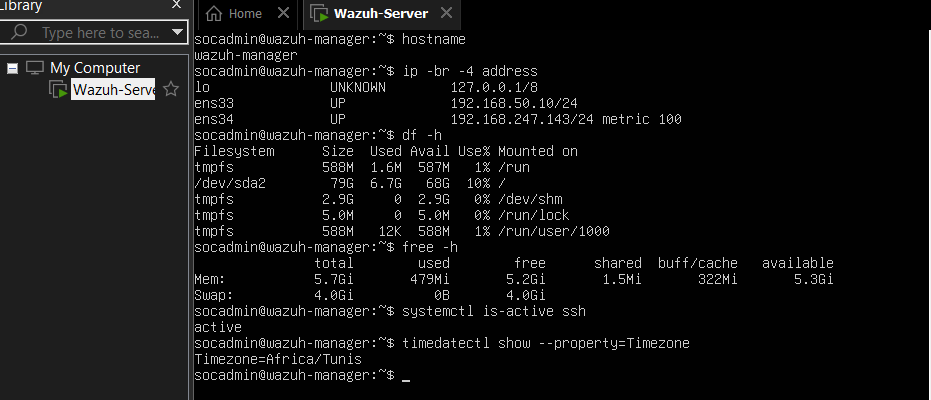

# Design and Implementation of a Wazuh-Based SOC Home Lab for Threat Hunting and Malware Detection

**Author:** TBD  
**Date:** 15 September 2026

## Abstract

This report documents the design, deployment, and evaluation of an isolated SOC home lab based on Wazuh. The environment contains a Wazuh server, a Windows 11 monitored endpoint, and a Kali Linux adversary-simulation host. Safe attack simulations are used to validate telemetry collection, malware detection, threat hunting, alert investigation, and MITRE ATT&CK mapping.

## 1. Introduction

### 1.1 Background

TBD

### 1.2 Problem statement

TBD

### 1.3 Objectives

- Build an isolated and reproducible SOC laboratory.
- Centralize security telemetry from a Windows endpoint.
- Detect and investigate representative malicious behaviors.
- Map observed behaviors and detections to MITRE ATT&CK.
- Evaluate detection coverage, false positives, and limitations.

### 1.4 Scope and ethical boundaries

Testing is restricted to systems owned by the author and connected to the isolated lab network. The project uses safe simulations and inert test files. No attack is directed at public services, third-party systems, or the physical local-area network.

## 2. Technical Background

### 2.1 Security operations and SIEM/XDR concepts

TBD

### 2.2 Wazuh architecture

TBD

### 2.3 Endpoint telemetry and Sysmon

Sysmon is a Microsoft Sysinternals service and kernel driver that records
high-value endpoint activity in the Windows event log. Depending on its XML
configuration, it can capture process creation, network connections, file
creation, registry modification, DNS queries, and other behavior that is not
available in sufficient detail from default Windows logging. Wazuh can ingest
the `Microsoft-Windows-Sysmon/Operational` event channel and apply native
rules to this telemetry.

### 2.4 MITRE ATT&CK

TBD

## 3. Requirements and Architecture

### 3.1 Hardware and software requirements

The physical host provides an Intel Core i5-12450H processor with eight cores
and twelve logical processors, 16 GB of RAM, hardware virtualization support,
and approximately 200 GB of free storage at the start of implementation.
VMware Workstation Pro provides the virtualization platform.

Ubuntu Server 24.04.3 LTS (`amd64`) was selected for the Wazuh server. The
downloaded 3,303,444,480-byte ISO produced the following local SHA-256
baseline:

```text
C3514BF0056180D09376462A7A1B4F213C1D6E8EA67FAE5C25099C6FD3D8274B
```

This value must be compared with Ubuntu's published checksum before the ISO
is trusted for installation.

The Windows endpoint uses the 64-bit English Windows 11 25H2 installation
image `Win11_25H2_English_x64.iso`. Its 7,736,125,440-byte download was
recorded with SHA-256 digest
`D141F6030FED50F75E2B03E1EB2E53646C4B21E5386047CB860AF5223F102A32`
for reproducibility and later integrity checks.

The authorized simulation host uses the 64-bit Kali Linux 2025.4 installer
`kali-linux-2025.4-installer-amd64.iso`. The 4,733,116,416-byte image was
recorded with SHA-256 digest
`3B4A3A9F5FB6532635800D3EDA94414FB69A44165AF6DB6FA39C0BDAE750C266`.

### 3.2 Network design and isolation

The laboratory uses VMware `VMnet2`, configured as a host-only network with
the subnet `192.168.50.0/24`. The VMware host adapter is connected to this
segment, while VMware DHCP is disabled so that every laboratory system can
use a documented static address. The Windows host received
`192.168.50.1/24`; the adapter has no default gateway because `VMnet2` is not
an Internet-facing network.

This design keeps authorized attack simulations away from the physical LAN.
VMware's separate NAT network (`VMnet8`) will be used only temporarily for
operating-system updates and software installation. The Kali attack host will
not be attached to a bridged interface.



*Figure 1: `VMnet2` configured as the isolated SOC-LAB network (EV-001).*

### 3.3 Risk assessment

TBD

## 4. Implementation

### 4.1 Virtual environment

The Wazuh server virtual machine was created as `Wazuh-Server` with four CPU
cores, 6 GB of RAM, and an 80 GB thin-provisioned virtual disk. Its primary
network adapter connects to the isolated `VMnet2` segment. A second NAT
adapter is available temporarily for installation, system updates, and
package retrieval; it will not be used for attack simulations.



*Figure 2: Initial Wazuh server hardware and network configuration (EV-002).*

The final VMware creation summary provides a second record of the allocated
disk, memory, processors, guest operating-system type, and both network
connections (EV-003).

During installation, the isolated interface `ens33` was assigned the static
address `192.168.50.10/24`. The temporary NAT interface `ens34` obtained
`192.168.247.143/24` through DHCP and supplied Internet access for updates.



*Figure 3: Static SOC-LAB and temporary NAT interfaces during installation (EV-004).*

The standard Ubuntu Server installation included OpenSSH Server and the
security updates available during installation. The installer completed
successfully before the server's first reboot (EV-005).

Post-installation validation confirmed the hostname `wazuh-manager`, the
planned static address, temporary NAT connectivity, approximately 79 GB of
root storage, 6 GB of allocated memory, an active SSH service, and the
`Africa/Tunis` timezone.



*Figure 4: Wazuh server baseline after Ubuntu installation (EV-006).*

The physical Windows host then reached TCP port 22 on `192.168.50.10` through
the `VMnet2` adapter. The successful test, sourced from `192.168.50.1`,
validated both private-network routing and availability of the Ubuntu SSH
service (EV-007).

Before snapshotting, the server was upgraded and rebooted into kernel
`6.8.0-139-generic`. SSH and `open-vm-tools` were active. Four related Netplan
patch packages remained eligible for Ubuntu's phased-update rollout, while
`apt-mark showhold` returned no held packages. This did not prevent baseline
creation or affect the static lab configuration (EV-008).

With the server powered off, a VMware snapshot named
`00-clean-os-updated` was created. This recovery point allows the Ubuntu
baseline to be restored if Wazuh deployment or later configuration changes
fail (EV-009).

The monitored Windows endpoint was created as `Windows11-Victim` with two CPU
cores, 4 GB of RAM, and a 64 GB thin-provisioned split disk. Like the Ubuntu
server, it uses `VMnet2` for isolated lab traffic and a second NAT adapter for
temporary installation and updates. The VM uses UEFI Secure Boot and an
encrypted virtual TPM to meet Windows 11 platform requirements (EV-010).

After installation, the endpoint was named `WIN11-VICTIM`. Its isolated
adapter was renamed `SOC-LAB`, assigned `192.168.50.20/24`, and classified as
a private Windows network. Its second adapter, `TEMP-NAT`, received
`192.168.247.145/24` and was the only interface with a default gateway and
Internet connectivity (EV-011).

Windows Update was run repeatedly after VMware Tools installation and reboot
until it reported that the endpoint was up to date. The option to receive
early non-security updates remained disabled (EV-012).

The endpoint runs Windows 11 Pro build 26200 with a Tunis-compatible Windows
timezone. Platform and protection checks confirmed UEFI Secure Boot, a
present and ready TPM, automatic VMware Tools and Defender services, and
enabled Defender antivirus, real-time protection, and behavior monitoring
(EV-013).

After powering off the endpoint, a VMware snapshot named
`00-clean-os-updated` was created before installing the Wazuh agent or Sysmon.
This preserves a clean, updated Windows recovery point for later testing and
configuration rollback (EV-014).

The authorized Kali simulation host was created as `Kali-Attacker` with two
CPU cores, 2 GB of RAM, and a 40 GB thin-provisioned disk. Its primary adapter
connects to isolated `VMnet2`; a second NAT adapter is available only for
installation and updates (EV-015).

After installation, Kali's `eth0` interface was assigned
`192.168.50.30/24` and saved as `SOC-LAB`, while DHCP-configured
`eth1` was labeled `TEMP-NAT`. Only `TEMP-NAT` carried a default route,
preventing the isolated interface from routing attack traffic outside the
lab (EV-016).

Kali was fully upgraded and rebooted into kernel `7.1.5+kali-amd64` with no
pending packages. Baseline validation showed 15 GB of free root storage,
approximately 1 GB of available memory, active `open-vm-tools`, the
`Africa/Tunis` timezone, and both expected IPv4 addresses (EV-017).

With Kali powered off, the snapshot `00-clean-os-updated` was created before
any authorized simulation activity. It provides a clean recovery point for
repeatable attack scenarios and cleanup (EV-018).

Before Wazuh deployment, the Windows victim at `192.168.50.20` successfully
reached TCP port 22 on the Ubuntu server at `192.168.50.10` through the
private `SOC-LAB` adapter. This validated the endpoint-to-manager path
independently of the earlier physical-host test (EV-019).

### 4.2 Wazuh deployment

The official Wazuh 4.14 installation assistant was downloaded from the URL
published in Wazuh's current quickstart documentation. Before privileged
execution, the 204 KiB script passed `bash -n` syntax validation and produced
the following SHA-256 digest:

```text
8EBE9514688ACE8AF9445805E8887CD491DD9F95FA9D421A70F0EA012AB06F3A
```

The first deployment attempt installed the indexer but failed when Ubuntu's
`unattended-upgr` process acquired the `dpkg` frontend lock immediately before
manager installation. Disk capacity, memory, and service health remained
normal. After the updater exited, the VM was restored to its clean snapshot;
automatic update timers were temporarily disabled, and the verified installer
was run again. This avoided modifying or forcibly deleting package-manager
lock files (EV-020).

The second attempt completed successfully and deployed Wazuh 4.14.7. Service
validation confirmed that `wazuh-manager`, `wazuh-indexer`,
`wazuh-dashboard`, and `filebeat` were active. The server listened on TCP
ports 443 (dashboard), 1514 (agent events), 1515 (agent enrollment), and
55000 (Wazuh API). The generated credential and certificate archive was
restricted to root access and excluded from project evidence and Git
(EV-021).

The dashboard was then reached from the physical host over HTTPS at
`192.168.50.10`. Its initial overview confirmed that the Wazuh application
was operational and that no endpoint agents were registered before Windows
enrollment (EV-022).

### 4.3 Windows agent and telemetry configuration

The dashboard deployment wizard generated the Windows MSI command for Wazuh
agent 4.14.7. It configured `192.168.50.10` as the manager and
`WIN11-VICTIM` as the agent name. The installer ran from an elevated
PowerShell session, after which the `WazuhSvc` service reported a `Running`
state (EV-023).

The dashboard subsequently reported agent ID `001` as active, with the name
`WIN11-VICTIM`, address `192.168.50.20`, Windows 11 Pro operating system,
agent version 4.14.7, and membership in the `default` group. This completed
bidirectional enrollment validation from both the endpoint service and the
manager dashboard perspectives (EV-024).

For enhanced telemetry, Sysmon 15.22 was downloaded directly from Microsoft
Sysinternals. The 2,938,038-byte ZIP produced SHA-256 digest
`00ECF1B46AEC99299D3AE0BCA79DC621458BD014B20B509D7C5C8E8C8611AA54`.
Before installation, the extracted 64-bit executable's Authenticode signature
was validated as `Microsoft Windows Publisher` (EV-027).

The initial ruleset uses the community-maintained SwiftOnSecurity baseline
configuration. The 123,257-byte XML file produced SHA-256 digest
`055FEBC600E6D7448CDF3812307275912927A62B1F94D0D933B64B294BC87162`.
It declares Sysmon schema 4.50, which remains compatible with Sysmon 15.22 but
does not expose every event type added by newer schemas. This version is used
for the core lab scenarios and is recorded as a limitation for later tuning.

Sysmon accepted the configuration, installed its service and kernel driver,
and started automatically. The `Microsoft-Windows-Sysmon/Operational` channel
was enabled and immediately contained process-creation Event ID 1 records,
confirming local telemetry generation before Wazuh ingestion was enabled
(EV-028).

The Wazuh agent's local configuration did not initially reference Sysmon.
Collection was therefore enabled centrally for Windows members of the
`default` group through a shared `agent.conf`. Wazuh's
`verify-agent-conf` utility validated the XML before distribution. The exact
configuration is preserved in `configs/wazuh/default-agent.conf`.

The central policy was then extended to ingest the Microsoft Defender
operational channel and enable real-time, change-reporting file integrity
monitoring for `C:\SOC-Lab\FIM`. After synchronization, the endpoint log
confirmed both event channels and the FIM directory were active (EV-031).

After agent synchronization and service restart, the Windows Wazuh log
explicitly reported that it was analyzing the
`Microsoft-Windows-Sysmon/Operational` channel. This confirmed that the
central configuration reached the endpoint and activated collection
(EV-029).

End-to-end validation launched a harmless child PowerShell process containing
the unique marker `WAZUH_SYSMON_PHASE4_TEST_20260917`. Sysmon recorded process
creation Event ID 1, and Wazuh generated rule `92027` (`Powershell process
spawned powershell instance`) at level 4. A query combining agent name, event
ID, and command-line marker returned exactly one matching record (EV-030).
This behavior maps to MITRE ATT&CK T1059.001, PowerShell.

Real-time file integrity monitoring was validated independently by creating
`C:\SOC-Lab\FIM\phase4-fim-test.txt`. Wazuh returned exactly one matching
event for `WIN11-VICTIM`, classified as `File added to the system` by rule
`554` at level 5 (EV-032). This demonstrates that changes under the centrally
configured monitored directory reach the manager and become searchable.

Microsoft Defender real-time protection was tested with the official,
non-replicating EICAR antivirus test file. Defender recorded Event ID 1116,
identified `Virus:DOS/EICAR_Test_File`, assigned Severe severity, and reported
the local test path (EV-033). The centrally collected Defender event then
appeared in Wazuh for `WIN11-VICTIM` as rule `62123` at level 12 (EV-034),
confirming end-to-end antimalware telemetry and alerting.

After the test artifacts were removed, the server and endpoint were powered
off and captured as the coordinated snapshot pair
`02-endpoint-telemetry-validated` (EV-035 and EV-036). These snapshots must be
restored together to preserve matching manager, agent, and shared-policy
state.

Finally, both VMs were powered off and captured as a coordinated recovery
pair: server snapshot `01-wazuh-deployed-agent-enrolled` and endpoint snapshot
`01-wazuh-agent-enrolled`. They must be restored together so the manager and
agent retain matching enrollment keys and state (EV-025 and EV-026).

### 4.4 Detection and enrichment configuration

Phase 4 used Wazuh's built-in Windows, Sysmon, Defender, and syscheck rules.
The validation events exercised rules `92027`, `554`, and `62123` at levels
4, 5, and 12 respectively. Custom rule tuning and optional enrichment are
deferred until the controlled Phase 5 simulations provide representative
events for Phase 6 investigation and tuning. No automated active response was
enabled during this baseline phase.

## 5. Detection Scenarios

For every scenario, document the objective, ATT&CK mapping, prerequisites, exact procedure, expected telemetry, Wazuh result, evidence, cleanup, and limitations.

### 5.1 Network reconnaissance

TBD

### 5.2 Authentication attacks

TBD

### 5.3 Suspicious PowerShell behavior

TBD

### 5.4 Malware and file-integrity detection

TBD

### 5.5 Persistence behavior

TBD

## 6. Threat Hunting and Incident Investigation

TBD

## 7. Results and Evaluation

Include detection rate, alert latency, false positives, resource consumption, ATT&CK coverage, and detection gaps.

## 8. Limitations and Recommendations

TBD

## 9. Conclusion

TBD

## References

TBD

## Appendices

### Appendix A — Address plan

| System | Role | Address |
|---|---|---|
| Windows physical host | VMware host and dashboard access | `192.168.50.1/24` |
| Ubuntu Server | Wazuh manager, indexer, and dashboard | `192.168.50.10/24` |
| Windows 11 VM | Monitored endpoint | `192.168.50.20/24` |
| Kali Linux VM | Authorized simulation host | `192.168.50.30/24` |

The virtual-machine addresses remain planned until connectivity validation is
completed. The host address was verified after creating `VMnet2`.

### Appendix B — Configuration excerpts

TBD

### Appendix C — Detection test matrix

TBD
